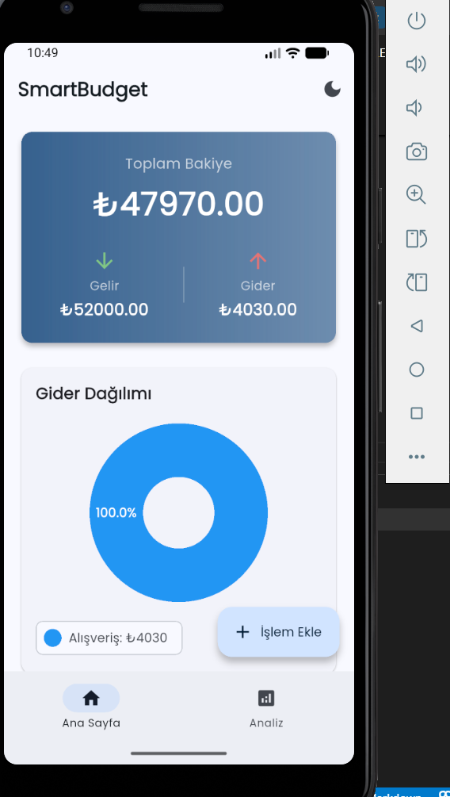
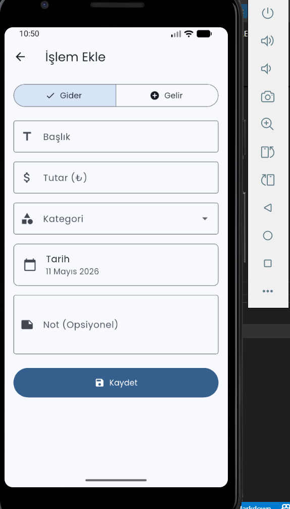
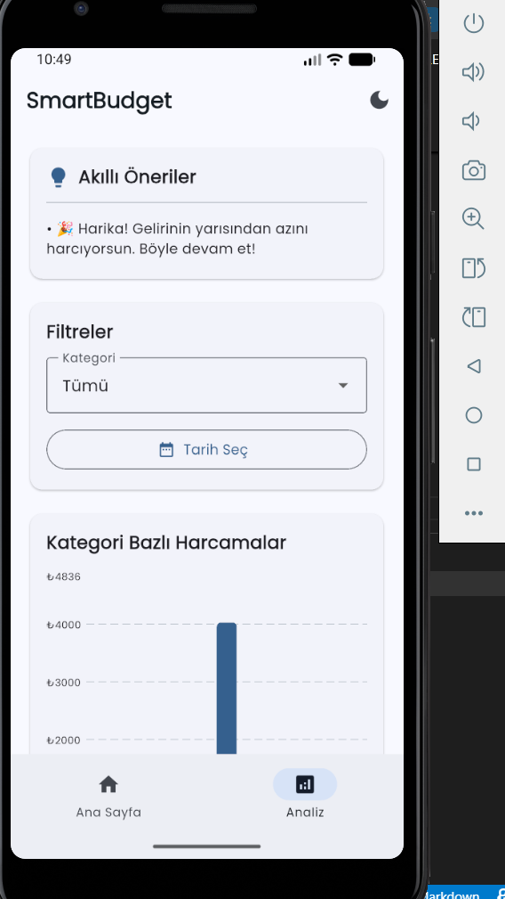

# 💰 SmartBudget

Kullanıcıların gelir-giderlerini takip ederek harcama alışkanlıklarını analiz etmelerini ve tasarruf için akıllı öneriler almalarını sağlayan Flutter mobil uygulaması.

## 📱 Ekran Görüntüleri

<p align="center">
  
  
  
</p>

## ✨ Özellikler

- 📊 **Gelir/Gider Yönetimi:** Günlük finansal hareketlerin takibi ve grafiksel analizi.
- 💡 **Akıllı Öneriler:** Harcama alışkanlıklarına göre tasarruf ipuçları ve uyarılar.
- 🔍 **Gelişmiş Filtreleme:** Kategori ve tarih bazlı detaylı sorgulama.
- 🌓 **Tema Desteği:** Karanlık ve aydınlık mod seçeneği.
- 💾 **Offline Çalışma:** SQLite entegrasyonu ile internet gerektirmeden kullanım.

## 🛠️ Teknolojiler

- **Framework:** Flutter
- **State Management:** Provider
- **Database:** SQLite
- **Charts:** fl_chart

## 🏗️ Mimari

Proje, sürdürülebilirlik ve test edilebilirlik için **Katmanlı Mimari (Layered Architecture)** yapısı kullanılarak geliştirilmiştir:

- **Models:** Veri yapıları ve SQLite eşleme sınıfları.
- **Views:** Flutter UI bileşenleri ve ekran tasarımları.
- **Providers:** İş mantığı (Business Logic) ve state yönetimi.
- **Services:** SQLite veritabanı işlemleri ve veri erişim katmanı.
- **Utils:** Sabitler, temalar ve yardımcı fonksiyonlar.

## 🚀 Kurulum

Projeyi yerel makinenizde çalıştırmak için aşağıdaki adımları izleyebilirsiniz:

```bash
# Projeyi klonlayın
git clone [https://github.com/silais34/smart_budget.git](https://github.com/silais34/smart_budget.git)

# Proje dizinine gidin
cd smart_budget

# Bağımlılıkları yükleyin
flutter pub get

# Uygulamayı çalıştırın
flutter run

lib/
├── models/         # Veri modelleri
├── providers/      # State yönetimi
├── screens/        # UI Ekranları
├── services/       # Veritabanı servisleri
├── utils/          # Yardımcı araçlar
└── widgets/        # Özel UI bileşenleri

👨‍💻 Geliştirici
Sıla İs Bilgisayar Mühendisliği Öğrencisi | Software Developer

GitHub: @silais34

LinkedIn: linkedin.com/in/sıla-is

E-posta: sila.is@icloud.com